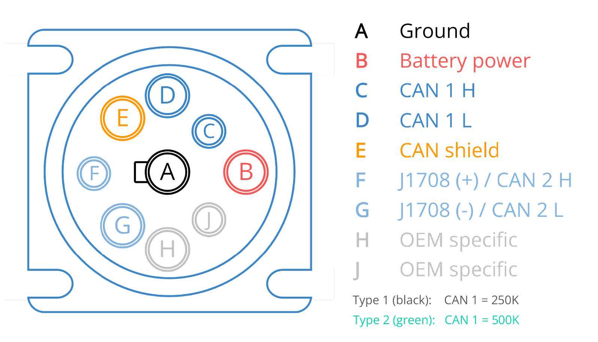
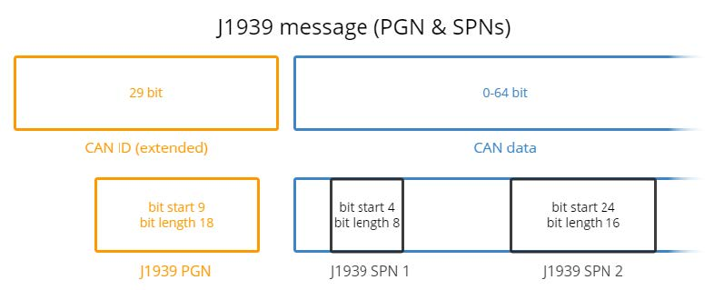

# J1939 Isn't a Cable — It's a Dictionary for CAN

## The Misconception I Started With

The first time most people encounter J1939, it's through a connector — a 9-pin Deutsch fitting on a heavy-duty truck or piece of off-road equipment. It's easy to walk away thinking "J1939" refers to that physical connector, the cable, the port itself.



That's not wrong, exactly. But it's incomplete in a way that matters. The connector is just one small piece (J1939-13, specifically) of a much bigger standard. The actual substance of J1939 has nothing to do with wires or pins. It's about what happens to the bytes once they're already on the bus.

## Same Wires, Standardized Meaning

J1939 runs on top of CAN. Same electrical layer, same differential CAN_H/CAN_L pair, same frame format you'd find on any CAN network. If you looked at a J1939 message and a proprietary CAN message side by side on an oscilloscope, you wouldn't see a difference — they're both just CAN frames.



The difference is entirely in how the payload is interpreted. A raw CAN frame, on its own, only means something to the specific engineers who defined that particular signal for that particular ECU. J1939 exists to standardize that interpretation, so that a message from a Cummins engine controller and a message from an Allison transmission controller can both be understood by the same diagnostic tool, using the same rules, without custom integration work for every manufacturer pairing.

In short: J1939 doesn't change what CAN *is*. It defines what CAN *means*.

## PGN: What Kind of Message Is This

The first layer of that standardized meaning is the **Parameter Group Number (PGN)**.

A PGN identifies the category of a message — engine temperature data, vehicle speed, diagnostic trouble codes, and so on. It's encoded directly in the 29-bit extended CAN identifier, which is one of the reasons J1939 requires extended-format CAN IDs rather than the standard 11-bit ones.

Think of the PGN as answering the question: *what kind of information is this message carrying?*

## SPN: What Specific Signal Is Inside It

Nested inside a PGN's data payload are one or more **Suspect Parameter Numbers (SPNs)**.

Where a PGN tells you the category, an SPN identifies the individual signal within that category — a specific value like coolant temperature or engine RPM. Each SPN has a defined byte position within the payload, a scaling factor, and a unit, all specified by the standard itself.

So the relationship is hierarchical:

```
PGN (message category)
 └── SPN (individual signal)
      ├── byte position
      ├── scaling factor
      └── unit
```

A diagnostic tool reading a J1939 frame doesn't need to guess where a value lives in the payload or what unit it's in — the PGN/SPN combination tells it exactly where to look and how to interpret what it finds.

## Why This Actually Matters: Interoperability

Here's the part that makes the PGN/SPN structure worth caring about, rather than just memorizing.

Before a standard like this, every manufacturer's CAN messages would mean whatever that manufacturer decided internally — engine temperature might live in byte 3 on one ECU and byte 5 on another, scaled differently, in different units. A diagnostic tool built for one manufacturer's equipment would be useless on another's without custom mapping work.

J1939 removes that problem for the signals it standardizes. As long as a PGN/SPN is defined by the standard, it means the same thing regardless of who built the ECU. That's what makes it possible for a single diagnostic tool, a single fleet-management system, or a single piece of test equipment to work across engines, transmissions, and body controllers from entirely different manufacturers — which matters enormously in heavy-duty trucking, construction, and agricultural equipment, where a single vehicle might combine components from several different suppliers.

## The Connector: J1939-13

This is where the physical piece finally comes in — and where my own hands-on experience actually connects.

**J1939-13** is the specific sub-standard that defines the physical diagnostic connector: a 9-pin Deutsch connector, with CAN_H and CAN_L carried on pins C and D. This is the connector I'd worked with directly during diagnostic and validation work — at the time, I understood it simply as "the diagnostic port." Going back through the standard properly, I now understand it as one deliberately defined piece of a much larger interoperability standard, not just a physical interface that happens to carry CAN traffic.

That's the value of going back and studying the standard behind a tool you've already used: the connector didn't change, but my understanding of *why* it's shaped the way it is, and what it's actually enabling underneath the physical layer, did.

## J1939 vs. UDS: Not the Same Job

It's worth drawing a clear line here, because these two protocols get confused, and the confusion usually comes from both running on CAN.

**J1939** is fundamentally a *broadcast, standardized-signal* protocol. Messages go out on the bus with predefined PGN/SPN meaning, and any node that cares can listen. It's common in heavy-duty and commercial vehicle networks, where interoperability across manufacturers is the priority.

**UDS (ISO 14229)** is a *request-response diagnostic session* protocol. A diagnostic tester sends a specific request — read a DTC, enter a diagnostic session, request a specific data identifier — and the ECU responds directly to that request. It's not broadcasting standardized signals continuously; it's a targeted conversation between a tester and a specific ECU.

Put simply: J1939 is closer to "here's what this data always means, broadcast for anyone listening." UDS is closer to "I'm asking you, specifically, for this piece of information, right now." Both can run on the same physical CAN bus, and both can even coexist in the same vehicle architecture, but they're solving different problems.

## The Interview-Ready Summary

If I had to explain J1939 in a single answer: J1939 is a standard built on top of CAN that gives the raw CAN payload standardized, cross-manufacturer meaning, rather than defining any new physical medium. The Parameter Group Number identifies what category of data a message carries, and the Suspect Parameter Number identifies the specific signal within it, down to byte position, scaling, and units. That standardization is what allows equipment from entirely different manufacturers to interoperate on the same network without custom integration work. The physical piece people usually associate with J1939 — the 9-pin Deutsch diagnostic connector — is actually just one defined sub-standard (J1939-13) within that larger framework, not the standard itself.

That's the distinction I got wrong at first, and it's the one worth having straight before walking into a technical interview.
