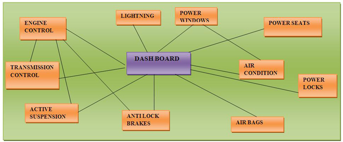

# LIN Bus Explained: Why Vehicles Don't Use CAN for Everything

## The Problem CAN Wasn't Built to Solve

A modern vehicle can have anywhere from 70 to 150+ electronic control units. Every window switch, mirror motor, HVAC blend door, and seat position sensor needs some way to talk to the rest of the car. **The obvious answer might be: just put everything on CAN**. It's fast, it's noise-resistant, it's the automotive standard.

**But CAN transceivers cost money**, CAN wiring adds weight and complexity, and none of those functions actually need CAN's speed or its multi-master arbitration. A window switch doesn't need to win a priority fight against an airbag deployment message. It needs to tell the body control module "button pressed" and that's it.

**This is the gap LIN was built to fill: a single-wire, low-cost network for the non-safety-critical, low-bandwidth corners of the vehicle — window switches, mirrors, seat modules, HVAC actuators, and similar body-domain functions.**

## Where LIN Sits in the Speed Hierarchy

LIN tops out at 19.2 kbit/s. For comparison:

```
LIN            ≤ 19.2 kbit/s
Low-speed CAN  ≤ 125 kbit/s
High-speed CAN ≤ 1 Mbit/s
```

That's not a limitation so much as a deliberate tradeoff. LIN uses a single wire instead of a differential pair, which is cheaper to implement and wire into a harness, but it also means LIN gives up CAN's common-mode noise rejection. For a door module or a mirror motor, that tradeoff is fine. For anti-lock braking, it would not be.

## The Core Mechanism: One Master, No Exceptions

This is the part of LIN that actually matters most, and it's the part most people gloss over.

CAN is multi-master. Any node can attempt to transmit at any time, and arbitration sorts out who wins. LIN throws that model out entirely. A LIN network has exactly one master — usually the body control module — and every other node on the bus is a slave. Slaves never initiate communication. They only speak when the master asks them to, and not a moment before.



The master doesn't just sit there waiting for something to happen. It works through a fixed, repeating **schedule table** — a predetermined sequence of message IDs that it polls, one after another, on a loop. If a window-lift module needs to report that a button was pressed, it can't just announce that. It has to wait for its slot in the schedule table to come around, get polled, and only then respond.

Here's a simple illustration of what that schedule table looks like in action:

```
Schedule Table (repeats continuously):

Slot 1 → Master polls Door Module      → Door Module responds
Slot 2 → Master polls Mirror Module    → Mirror Module responds
Slot 3 → Master polls Seat Module      → Seat Module responds
Slot 4 → Master polls HVAC Module      → HVAC Module responds
        ↳ loop back to Slot 1
```

If you press the window-up button right after Slot 1 has already passed, the request doesn't go out immediately — it waits until the schedule loops back around to the Door Module's slot again. That's a real design tradeoff: LIN is time-triggered and deterministic, but that determinism comes at the cost of polling latency. For a window switch, a few milliseconds of delay is invisible. For something more time-sensitive, that same tradeoff would be unacceptable — which is exactly why LIN stays scoped to body-domain, non-critical functions.

## Frame Anatomy: Header and Response

Every LIN transaction has two parts.

**The Header** — sent by the master, made up of three pieces:

```
Break  →  Sync (0x55)  →  PID
```

- **Break**: a deliberate low pulse that acts as a wake-up signal, telling every node on the bus that a new frame is starting.
- **Sync (0x55)**: a fixed byte pattern that lets each slave calibrate its local clock timing against the master's. This matters because LIN, like UART, has no shared clock wire — nodes rely on their own internal oscillators, and the Sync byte is what keeps them close enough in sync to read the frame correctly.
- **PID (Protected Identifier)**: identifies which slave is being addressed for this slot.

**The Response** — filled in only by the slave that owns that PID. Every other slave on the bus sees the header, checks whether the PID matches its own, and stays silent if it doesn't.

```
Header (Master)              Response (Addressed Slave Only)
┌───────┬──────┬─────┐       ┌──────────────┬──────────┐
│ Break │ Sync │ PID │  ───► │ Data Byte(s) │ Checksum │
└───────┴──────┴─────┘       └──────────────┴──────────┘
```

## Scaling Beyond One Network

A single LIN network doesn't scale indefinitely. In practice, node count tops out around 16 — not because the protocol enforces a hard wall (the PID field technically allows more), but because bandwidth and schedule-table timing become impractical well before you'd hit a protocol limit. A schedule table with too many slots means longer round-trip latency for every function on that network, which defeats the purpose.

So real vehicles don't run one LIN network. They run several — one per functional domain, each with its own master and its own schedule table. A door-domain LIN network, a seat-domain LIN network, an HVAC-domain LIN network, each independent of the others.

This is the same segmentation logic that shows up one level up the hierarchy, at the CAN-bus level. Vehicles don't run everything on a single CAN bus either — they split into domain buses (powertrain, chassis, body, infotainment, diagnostic), tied together by gateway ECUs that relay only the traffic that genuinely needs to cross domains. LIN networks plug into this same structure: a LIN network typically hangs off the body CAN bus, with a gateway ECU (often the BCM itself) bridging between the LIN schedule-table world and the CAN broadcast world.

The underlying principle repeats at every layer: **isolate by function, connect only where necessary.**

## LIN vs. CAN, Side by Side

| | LIN | CAN |
|---|---|---|
| Wires | Single wire | Differential pair (CAN_H / CAN_L) |
| Max speed | 19.2 kbit/s | Up to 1 Mbit/s (Classical CAN) |
| Architecture | Strict single master, polled slaves | Multi-master with arbitration |
| Access model | Time-triggered schedule table | Event-driven, any node can attempt to transmit |
| Noise resistance | Lower (single-ended) | Higher (differential, common-mode rejection) |
| Typical use | Window switches, mirrors, seat modules, HVAC actuators | Powertrain, chassis, safety-relevant systems |
| Cost per node | Lower | Higher |

## The Interview-Ready Summary

If I had to explain LIN in a single answer: LIN is a low-cost, single-wire network built for the non-critical, low-bandwidth corners of a vehicle — window switches, mirrors, seat and HVAC modules — where CAN's cost and complexity aren't justified. It runs on a strict single-master, polled-slave model, where a fixed schedule table determines exactly when each slave gets to respond, trading some latency for deterministic, predictable timing. Because one LIN network can only scale to so many nodes before schedule-table timing degrades, vehicles run multiple LIN networks segmented by domain, each bridged into the broader CAN architecture through a gateway. It's a smaller-scale example of the same design principle that shapes the whole vehicle network: split traffic by function, and only cross domains when a message genuinely needs to.

That's the version I'd want in my head walking into a technical screen — not just the frame format, but *why* LIN looks the way it does.
